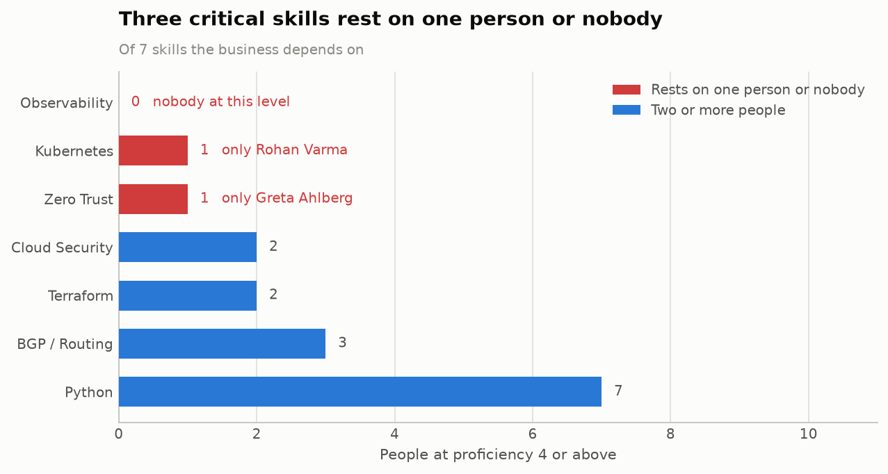
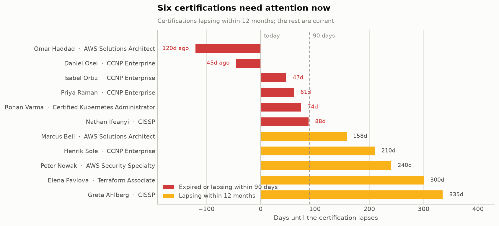
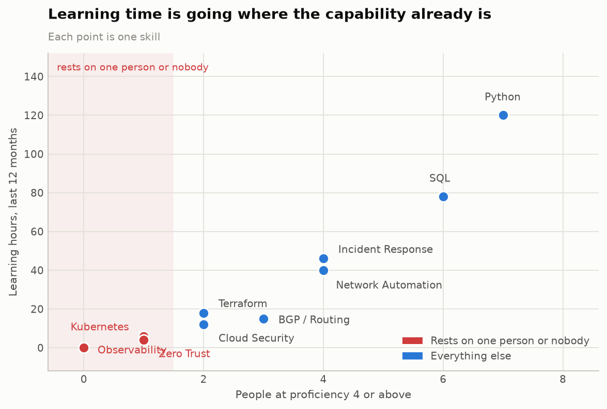

# Skills analysis — findings

**As of 22 September 2026** · 30 people across 5 teams ·
10 tracked skills · 22 certifications ·
339 learning hours in the last 12 months

Three things in this data are worth acting on. All three point the same way: the
organisation is investing in capability it already has, while the capability it
depends on sits with one person at a time.

---

## Finding 1 — 3 of 7 critical skills rest on one person or nobody

<picture>
  <source media="(prefers-color-scheme: dark)" srcset="charts/01-critical-skill-depth-dark.png">
  
</picture>

A skill is only genuinely covered when more than one person can carry it without
help. On that test, three of the seven skills the business depends on are a single
unplanned absence away from a gap:

| Skill | People who have it | At level 4+ | Who it rests on |
|---|---:|---:|---|
| Observability | 16 | **0** | nobody |
| Kubernetes | 6 | **1** | Rohan Varma |
| Zero Trust | 4 | **1** | Greta Ahlberg |

**Observability is the one to look at twice.** 16 of
30 people have it — the most widely held skill after Python — and not
one of them is above intermediate. Breadth has been mistaken for depth. That is also
what makes it the cheapest gap to close: the base is already there.

---

## Finding 2 — 6 certifications are expired or lapse within 90 days

<picture>
  <source media="(prefers-color-scheme: dark)" srcset="charts/02-certification-expiry-dark.png">
  
</picture>

2 have already lapsed and 4 lapse inside
90 days — **$3,694 of the
$10,657 certification budget**. Renewals need exam
booking and study time, so the cost of finding out late is the whole problem:

| Worker | Certification | Status |
|---|---|---|
| Omar Haddad | AWS Solutions Architect | Expired 120 days ago |
| Daniel Osei | CCNP Enterprise | Expired 45 days ago |
| Isabel Ortiz | CCNP Enterprise | Lapses in 47 days |
| Priya Raman | CCNP Enterprise | Lapses in 61 days |
| Rohan Varma | Certified Kubernetes Administrator | Lapses in 74 days |
| Nathan Ifeanyi | CISSP | Lapses in 88 days |

---

## Finding 3 — learning time is going where the capability already is

<picture>
  <source media="(prefers-color-scheme: dark)" srcset="charts/03-learning-vs-coverage-dark.png">
  
</picture>

Of 339 learning hours in the last twelve months,
**10 (3%) went to the three skills that rest
on one person or nobody.** Python took 120 hours — the
largest single share — and already has 7 people at
level 4+. Observability received none at all.

This is not a motivation problem. People are learning; the hours are simply
uncorrelated with where the risk is, because nothing connects the two.

---

## What to do about it

### 1. Give Kubernetes and Zero Trust a second owner this quarter

Name a backup for each, and give them time with
Rohan Varma and Greta Ahlberg rather than a course.
Two people, two skills, one quarter — this is the smallest change that removes the
sharpest risk.

### 2. Build Observability depth from the 16 people who already have the basics

No hiring required. Pick three or four of them, set a target of level 4 by the end
of the next quarter, and give it real hours. A skill with a wide shallow base is the
easiest kind of gap to close.

### 3. Point next year's learning budget at the gaps, not the strengths

Move roughly a third of the 339 hours toward the exposed skills. The current
split is close to the opposite of what the coverage data argues for, and no one has to
learn less — Python is simply already covered.

---

## Method and limits

- **Proficiency is a 1–5 scale.** Level 4+ means "can carry the skill without
  help", which is what a bus-factor number has to mean to be worth anything.
- **Criticality is a judgement, not a measurement.** The seven critical skills are
  listed at the top of `Code/skills_analysis.ipynb`. It drives Finding 1, so it is the
  first assumption to challenge.
- **30 people.** Percentages move about three points per person — read
  the counts, not the decimals.
- **The as-of date is pinned** to 2026-09-22, so every figure here is reproducible rather
  than drifting with the calendar.
- Every number and chart on this page is generated by the notebook. Re-running it
  overwrites this file, so it cannot drift from the data.
